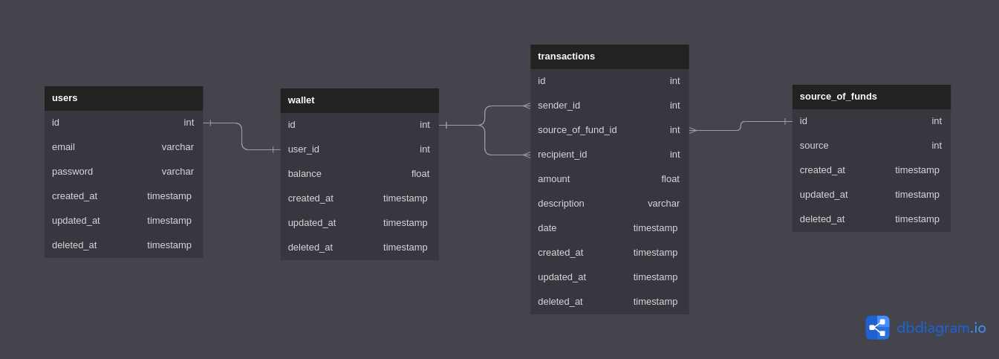

# assignment-golang-backend

## Project Description
E-wallet provides API for doing authentication and transaction

## Entity Relationship Diagram (ERD)


## Setup Project
1. Clone this repository to a local directory

2. You can seed the database using wallet_db_andra.sql in the db folder ito PostgreSQL database

3. Copy .env.example and rename to .env, fill the required variables

4. You can setup the project using 

```sh
go mod tidy
go run .
```

5. Go to http://localhost:8080/docs to see the documentations

6. For login, you can use either one of these email below and use "password" as password
```sh
andra@gmail.com
andra2@gmail.com
andra3@gmail.com
andra4@gmail.com
andra5@gmail.com
```


